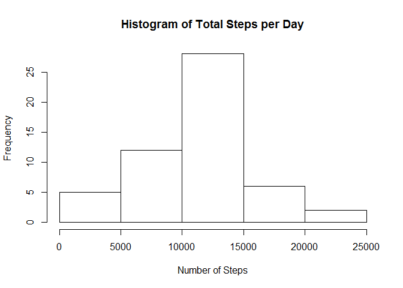
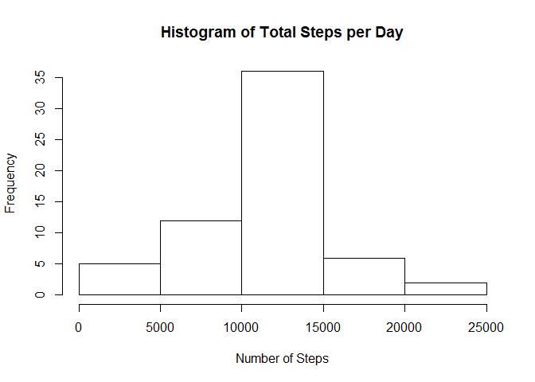

# Reproducible Research: Peer Assessment 1


## Loading and preprocessing the data

Load the data and look at it with str and summary.


```r
activity <- read.csv("activity/activity.csv")
str(activity)
```

```
## 'data.frame':	17568 obs. of  3 variables:
##  $ steps   : int  NA NA NA NA NA NA NA NA NA NA ...
##  $ date    : Factor w/ 61 levels "2012-10-01","2012-10-02",..: 1 1 1 1 1 1 1 1 1 1 ...
##  $ interval: int  0 5 10 15 20 25 30 35 40 45 ...
```

```r
summary(activity)
```

```
##      steps                date          interval     
##  Min.   :  0.00   2012-10-01:  288   Min.   :   0.0  
##  1st Qu.:  0.00   2012-10-02:  288   1st Qu.: 588.8  
##  Median :  0.00   2012-10-03:  288   Median :1177.5  
##  Mean   : 37.38   2012-10-04:  288   Mean   :1177.5  
##  3rd Qu.: 12.00   2012-10-05:  288   3rd Qu.:1766.2  
##  Max.   :806.00   2012-10-06:  288   Max.   :2355.0  
##  NA's   :2304     (Other)   :15840
```

The following code shows that there are 2304 missing values and these consist off all 288 values for 8 days.


```r
sum(is.na(activity$steps))
```

```
## [1] 2304
```

```r
nas <- is.na(activity$steps)
nas_per_day <- aggregate(nas ~ date, activity, sum)
print(nas_per_day[nas_per_day$nas > 0,])
```

```
##          date nas
## 1  2012-10-01 288
## 8  2012-10-08 288
## 32 2012-11-01 288
## 35 2012-11-04 288
## 40 2012-11-09 288
## 41 2012-11-10 288
## 45 2012-11-14 288
## 61 2012-11-30 288
```

## What is mean total number of steps taken per day?

Aggregate steps by date.  Note that the steps_per_day does not contain the 8 days that only have missing data.


```r
steps_per_day <- aggregate(steps ~ date, activity, sum)
steps_per_day$steps
```

```
##  [1]   126 11352 12116 13294 15420 11015 12811  9900 10304 17382 12426
## [12] 15098 10139 15084 13452 10056 11829 10395  8821 13460  8918  8355
## [23]  2492  6778 10119 11458  5018  9819 15414 10600 10571 10439  8334
## [34] 12883  3219 12608 10765  7336    41  5441 14339 15110  8841  4472
## [45] 12787 20427 21194 14478 11834 11162 13646 10183  7047
```

Draw a histogram and calculate mean and median to be 10766.19 and 10765, respectively.


```r
hist1 <- hist(steps_per_day$steps, main = paste("Histogram of Total Steps per Day"), xlab="Number of Steps")
```

 

```r
mean1 <- mean(steps_per_day$steps)
mean1
```

```
## [1] 10766.19
```

```r
med1  <- median(steps_per_day$steps)
med1
```

```
## [1] 10765
```

## What is the average daily activity pattern?

Graph the average number of step by interval over all days.


```r
steps_by_interval <- aggregate(steps ~ interval, activity, mean)
plot(steps_by_interval$interval, steps_by_interval$steps, type="l", xlab="Interval", ylab="Number of Steps", main="Average Number of Steps per Day by Interval")
```

 

The following shows that the maximum number of steps is 206.1698 and that occurs during interval 835.


```r
max_step <- max(steps_by_interval$steps)
max_interval <- steps_by_interval$interval[steps_by_interval$step == max_step]
max_step
```

```
## [1] 206.1698
```

```r
max_interval
```

```
## [1] 835
```

## Imputing missing values

As previously shown, the following code shows that there are 2304 missing values and these consist off all 288 values for 8 days.


```r
sum(is.na(activity$steps))
```

```
## [1] 2304
```

```r
nas <- is.na(activity$steps)
nas_per_day <- aggregate(nas ~ date, activity, sum)
print(nas_per_day[nas_per_day$nas > 0,])
```

```
##          date nas
## 1  2012-10-01 288
## 8  2012-10-08 288
## 32 2012-11-01 288
## 35 2012-11-04 288
## 40 2012-11-09 288
## 41 2012-11-10 288
## 45 2012-11-14 288
## 61 2012-11-30 288
```

Replace missing values with average number of steps for each interval over all of the days.


```r
activity2<- activity
nas <- is.na(activity2$steps)
avg_interval<- tapply(activity2$steps, activity2$interval, mean, na.rm=TRUE, simplify = TRUE)
#avg_interval <- steps_by_interval$steps
activity2$steps[nas] <- avg_interval[as.character(activity2$interval[nas])]
sum(is.na(activity2$steps))
```

```
## [1] 0
```


```r
steps_per_day2 <- aggregate(steps ~ date, activity2, sum)
hist2 <- hist(steps_per_day2$steps, main = paste("Histogram of Total Steps per Day"), xlab="Number of Steps")
```

 

```r
mean2 <- mean(steps_per_day2$steps)
med2  <- median(steps_per_day2$steps)
```

The following code shows that imputing missing values added data for the 8 days that were previously missing.  Since the imputted values for each interval was equal to the mean of that interval over all of the days which did have data, it would reason that the 8 missing days had the mean daily number of steps.  Hence, those 8 days were added to the central span in the histogram. The mean remained the same because the 8 additional days added had the mean number of daily steps.  The median became equal to the mean, apparently because one of those eight days added became the median.  This is all verified by the code below.


```r
hist1$counts
```

```
## [1]  5 12 28  6  2
```

```r
hist2$counts
```

```
## [1]  5 12 36  6  2
```

```r
mean1
```

```
## [1] 10766.19
```

```r
mean2
```

```
## [1] 10766.19
```

```r
med1
```

```
## [1] 10765
```

```r
med2
```

```
## [1] 10766.19
```

## Are there differences in activity patterns between weekdays and weekends?

The following code and plot show that there are differences in activity patterns between weekdays and weekends. On weekdays, the activity starts a bit after 5 AM and spikes between about 8 AM and 9 AM.  On weekends, the activity starts a bit later, around 7 or 8 AM, and is a bit higher on average for the rest of the day until it drops off at about 10 PM.


```r
activity2$weekday <- weekdays(as.Date(activity2$date))
activity2$dow <- "Weekday"
activity2$dow[activity2$weekday=="Saturday" | activity2$weekday=="Sunday"] <- "Weekend"
steps_by_interval_i <- aggregate(steps ~ interval + dow, activity2, mean)

library(lattice)
xyplot(steps_by_interval_i$steps ~ steps_by_interval_i$interval|steps_by_interval_i$dow, main="Average Steps per Day by Interval",xlab="Interval", ylab="Steps",layout=c(1,2), type="l")
```

 
